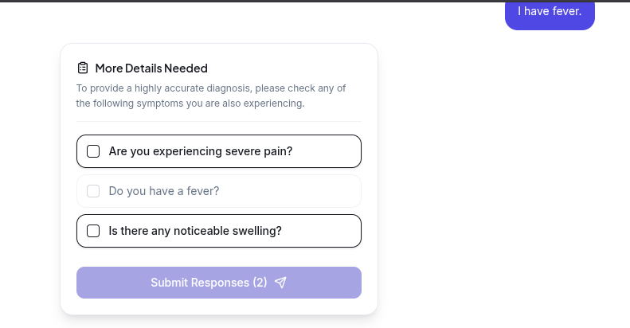
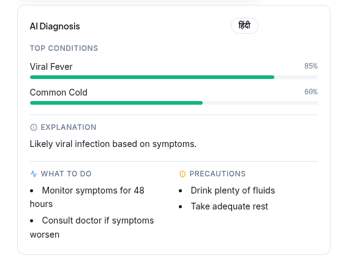
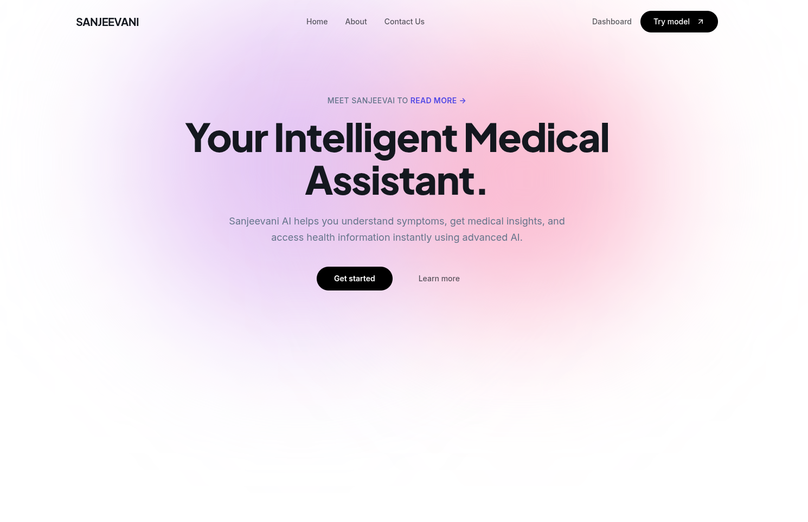
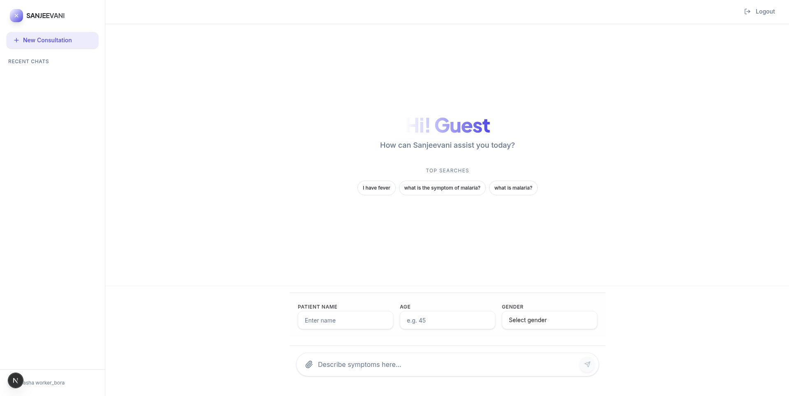
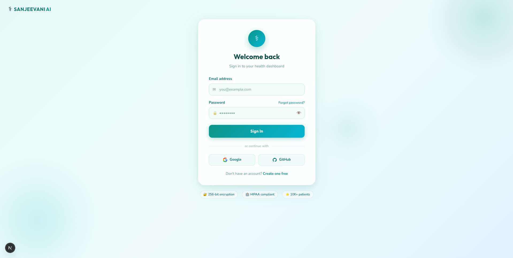
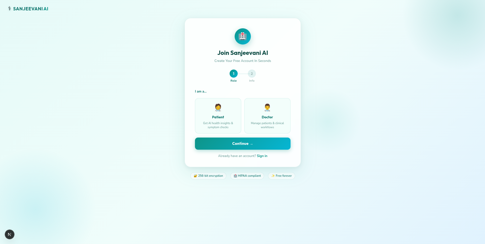

🏥 Sanjeevani AI – Rural Medical Assistant

Sanjeevani AI is an AI-powered rural healthcare assistant that helps health workers and patients quickly analyze symptoms, prescriptions, and medical history using AI.

The system performs AI triage, diagnosis, prescription analysis, and doctor escalation to support healthcare in remote areas.

⸻

🚀 Features

🧠 AI Symptom Analysis

Users can enter symptoms and the system predicts possible conditions using Gemini AI.

📋 AI Triage System

Before diagnosis, the AI asks follow-up questions to better understand the patient condition.

📜 Prescription Analysis

Upload a prescription image or PDF and the AI extracts:
	•	Doctor name
	•	Medicines
	•	Dosage instructions
	•	Precautions
	•	Summary

🧑‍⚕️ Doctor Assistance (24/7)

After diagnosis, a doctor can evaluate the case severity:
	•	🟢 Low
	•	🟡 Medium
	•	🔴 Severe → emergency slot suggested

📚 Patient History

Previous medical records are stored in MongoDB and used as context for future diagnosis.

⸻

🧩 Tech Stack

Frontend
	•	Next.js
	•	React
	•	TailwindCSS
	•	Framer Motion
	•	Shadcn UI

Backend
	•	FastAPI
	•	Python
	•	MongoDB
	•	PyMongo

AI Models
	•	Google Gemini 2.5 Flash

📂 Project Structure
Sanjeevani-AI
│
├── frontend
│   ├── src/app
│   ├── components
│   └── package.json
│
├── backend
│   ├── routes
│   ├── services
│   ├── db
│   └── main.py
│
└── README.md

User symptom
↓
AI triage questions
↓
AI diagnosis
↓
Patient history stored
↓
Doctor severity evaluation
↓
Emergency escalation if needed

team name - team rocket
aryaman bohra
vansh bhardwaj
bobby sharma 
aryan gupta
anmol saini

